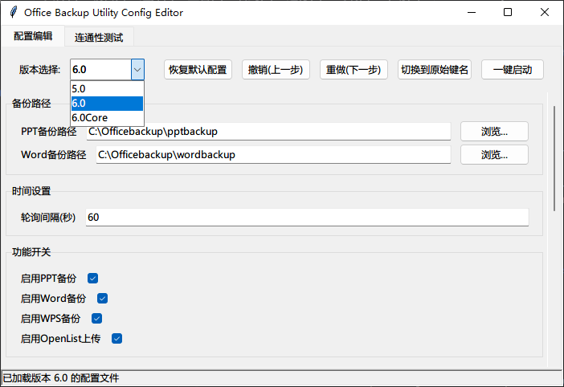
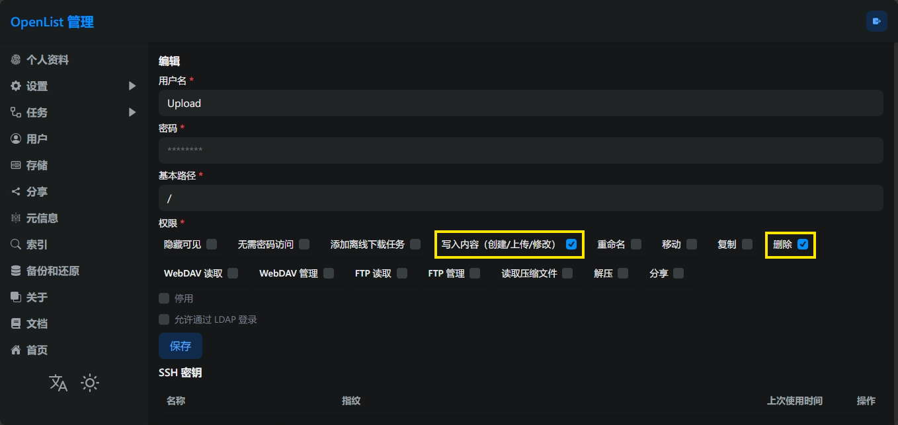
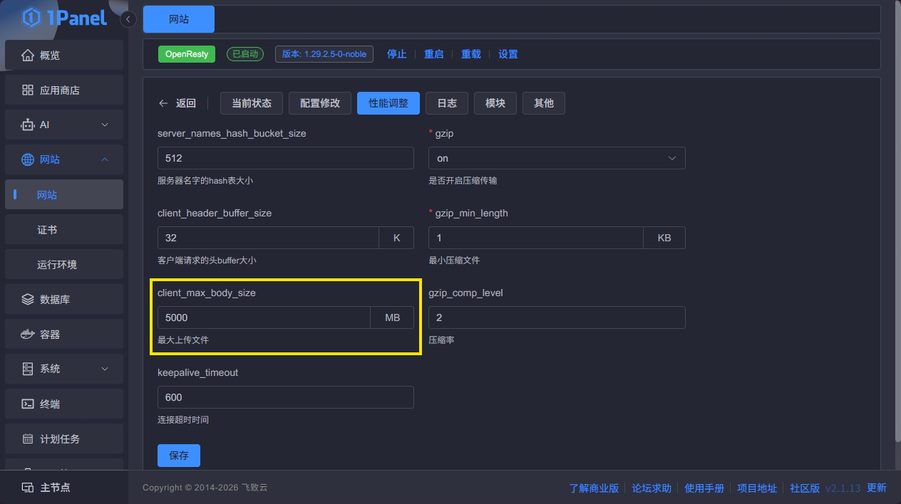
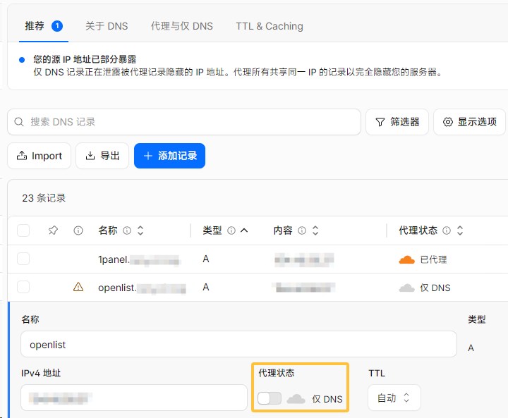
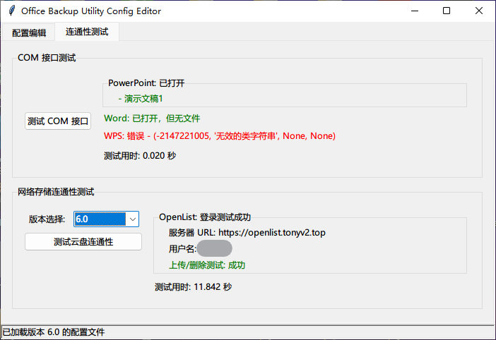

# [OBU] Office Backup Utilities

**一个用来备份当前打开的PPT和Word文档并上传到云存储的Python小程序**  
**A Python-based mini program for backing up currently opened Powerpoint & Word documents and uploading them to cloud storage.**  
  
源代码以MIT协议公开，全部有注释，欢迎研究、交流与改进  
The source code is open under the MIT license and is fully annotated. Study, communications and modifications are welcome.  

> [!NOTE]
> WPS的备份功能**理论上只支持WPS专业版，个人版不可用（除非劫持了Powerpoint的COM接口）**，且**只能备份PPT，不能备份Word**，WPS2019教育考试专用版经实测可用，可至<https://hellowindows.cn>中的Office/WPS分区下载，来自此网站的WPS2019教育考试专用版123云盘链接：<https://www.123pan.com/s/ZrzA-2UZgh>

## 版本选择

**稳定版本：6.2（推荐，最新，功能全面）或4.2（经过长期使用，运行稳定，依赖项少）  
6.2Core版本在仅保留6.2版本基本的本地备份功能与新特性的同时最小化了依赖项，可按需取用**

|版本|本地备份|托盘图标|对接Openlist|对接123云盘|配置文件编辑器|
|--|--|--|--|--|--|
|**6.2**|✅（单个程序）|✅|✅|✅（可通过Openlist挂载）|✅|
|**6.2Core**|✅（单个程序）|❌|❌|❌|✅|
|5.0|✅（单个程序）|✅|❌|✅（直接通过Python对接）|✅|
|4.2|✅（三个独立程序）|❌|❌|❌|❌|

## 使用方法

### 6.2版本-直接运行（二进制文件）

1. 下载Release中的Officebackup6.2.exe（支持Windows7及以上系统）；如果要使用Openlist上传功能，请参照[官方文档](https://doc.oplist.org)**自行部署Openlist服务并挂载存储**，确保服务能在运行程序的环境下访问（除非是局域网访问（应该不可能），否则需要拥有公网可访问的域名/IP，或做好内网穿透）  
2. 下载ConfigEditor.exe，放置在主程序的同级目录下，按需修改配置项，方法[见下](#配置文件编辑器config-editor)
3. （可选）把程序放在某个隐蔽的角落，右键创建一个快捷方式，按win+r打开运行框，输入shell:startup，这个文件夹是Windows启动项的文件夹，把快捷方式丢进去就可以实现开机自动以最小化窗口运行（不能直接将程序放在此文件夹中，无法生效）

### 6.2版本-从源码运行

1. 安装Python 3.8及以上版本  
2. 在命令行中执行以下命令安装依赖：  

    ```shell
    pip install -U pywin32 Pillow pystray alist3==1.3.1
    ```

    也可在程序所在目录内使用：

    ```shell
    pip install -r requirements.txt
    ```

    如果是6.2Core版本，只需要安装pywin32库：  

    ```shell
    pip install pywin32
    ```

3. 下载Officebackup6.2.py和ConfigEditor.py，放置在同级目录下，使用方法[同上](#62版本-直接运行二进制文件)  

### 4.2版本-直接运行（二进制文件）

按需下载Release中的pptbackup.4.2.exe、wordbackup.4.2.exe、pptbackup.4.2-WPS.exe，只能使用默认的备份路径（"C:\pptbackup"或"C:\wordbackup"）和轮询周期（180秒），无法修改，如果需要修改备份路径或轮询周期，请使用下面的方法[从源码运行](#42版本-从源码运行)  

### 4.2版本-从源码运行

1. 安装Python 3.8及以上版本  
2. 在命令行中执行以下命令安装pywin32库：

    ```shell
    pip install pywin32
    ```

3. 自行修改倒数第7行save_folder变量指定的保存路径（前面的r表示绝对路径），默认在C盘根目录下创建pptbackup文件夹；倒数第9行的time.sleep()里可以自行调节轮询的时间周期，单位是秒，默认为3分钟一次（180秒）  
4. （可选）把源码放在某个隐蔽的角落，右键创建一个快捷方式（可以右键打开属性，设置为打开时最小化窗口），按win+r打开运行框，输入shell:startup，这个文件夹是Windows启动项的文件夹，把快捷方式丢进去就可以实现开机自动以最小化窗口运行（不能直接将程序放在此文件夹中，无法生效）  
5. （可选，不建议）如果想要完全静默运行，不弹出运行框，先将Python文件名中的空格删除（例如将pptbackup 4.0.py改为pptbackup4.0.py，否则无法索引到），新建一个文本文档，输入以下代码，其中引号部分要换成Python文件的路径（Windows10/11可以直接右键，点复制文件路径）：  

    ```vb
    Set ws = CreateObject("Wscript.Shell")
    ws.run "C:\pptbackup4.0.py",vbhide
    ```

    保存退出，将文件后缀名由.txt改为.vbs，弹出提示框确认更改；最后与第3步一样，为VBS文件创建快捷方式，放到shell:startup文件夹内（不能直接将VBS脚本放在此文件夹中，无法生效；放入VBS脚本后，Python文件的快捷方式就不用放置了，否则将启动两个程序）  
    此种方式若需要停止程序运行，只能到任务管理器中结束所有Python相关进程，不方便监控程序运行情况，请酌情使用  

### 配置文件编辑器（Config Editor）

#### 配置编辑页面

  

在左上角选择程序对应的版本（6.2、6.2Core或5.0），在下方按需修改配置项，所有修改将实时保存到配置文件  

在右上角可以进行这些操作：  

* `恢复默认配置`：恢复当前版本的默认配置  
* `撤销（上一步）`、`重做（下一步）`：撤销或重做修改  
* `（切换到原始/简明键名）`：在 显示Json文件的原始键名 和 显示其对应的中文含义 之间切换
* `一键启动`：启动当前版本的程序（需要同级目录下有对应版本程序的.py或.exe文件）  

> [!IMPORTANT]
>
> 1. 6.2版本中，若要启用Openlist上传功能，必须填入Openlist的服务器URL、用户名和目标文件夹路径（即`openlist_url`、`openlist_username`和`openlist_target_folder`三个配置项），程序启动时将校验参数完整性，若不完整将强制禁用Openlist上传功能  
> 2. 填入的Openlist用户必须至少拥有`写入内容（创建/上传/修改）`和`删除`权限  
>   

$~$

> [!WARNING]
> 如果Openlist上传时报413错误，请按下方步骤依次排查：
>
> 1. 如果使用了Nginx或Openresty进行反向代理，请确保配置文件（`Nginx.conf`）中的`client_max_body_size`参数设置为大于等于上传文件的大小（Nginx默认为1MB，绝对不够用），下方为1Panel的修改示例（改成了5000MB）：
> 
> 2. 如果使用的是Cloudflare Free计划的域名，免费版会有100MB的最大上传文件大小限制，必须关闭该条解析的小黄云（代理），使用仅DNS模式，确保请求不经过Cloudflare网络（尽管这样可能导致服务器IP暴露，但是没办法，无论是开启开发模式还是配置缓存绕过规则都是没有用的）
> 
> 3. 如果都不行或觉得不妥，建议直接通过IP加端口号访问，如有防火墙或安全组记得放开Openlist所在端口（若使用Docker部署，默认为5244）

6.2版默认配置文件以及各配置项含义解释：  

```json
{
    //指定备份路径，注意路径中的反斜杠需要转义
    "ppt_backup_path": "C:\\Officebackup\\pptbackup",   //PPT、WPS备份路径
    "word_backup_path": "C:\\Officebackup\\wordbackup",   //Word备份路径
    //指定轮询间隔
    "interval": 60,   //指定执行完一轮操作后等待的时间间隔，单位为秒（默认60秒）
    //功能开启或禁用
    "ppt_backup_enable": true,   //PPT备份功能
    "word_backup_enable": true,   //Word备份功能
    "wps_backup_enable": true,   //WPS备份功能
    "upload_to_openlist_enable": true,   //上传到OpenList功能
    //OpenList参数
    "openlist_url": "",   //OpenList服务器URL
    "openlist_username": "",   //OpenList用户名
    "openlist_password": "",   //OpenList密码
    "openlist_target_folder": "",   //目标文件夹路径（相对路径，根目录用"/"表示）
    //文件夹精确备份功能
    "accurate_backup_enable": false,
    "accurate_backup_source_path": "",
    "accurate_backup_target_path": "",
    //托盘图标、控制台行为与日志保存设置
    "hide_tray_icon": false,   //是否隐藏托盘图标，True为隐藏，False为显示（默认）
    "show_console_window_at_startup": false,   //程序启动时显示控制台窗口，True为显示，False为隐藏（默认）
    "save_log": true,   //是否保存日志到OBUlatest.log文件，True为保存（默认），False为不保存
    "archive_previous_log": true,   //是否在程序启动时归档之前的日志（重命名为OBUprevious.log），True为归档（默认），False为直接覆盖
    "log_abnormal_upload": false,   //是否记录上传异常的文件到OBUabnormal.txt，True为记录，False为不记录（默认）
    //超时和重试设置
    "backup_timeout": 600,   //备份操作超时时间，单位为秒（默认10分钟）
    "upload_retry_wait": 30,   //上传重试等待时间，单位为秒（默认30秒）
    "upload_max_retries": "",   //上传最大重试次数，默认为空，表示无限次重试
    "upload_cache_expire_seconds": 1800   //上传缓存有效期，单位为秒（默认为30分钟，与Openlist默认缓存有效期一致）
}
```

#### 连通性测试页面

  

在此页面中，可以测试COM接口和网络存储的连通性：  

* COM接口测试：检查能否正常捕获Powerpoint、Word和WPS实例，若捕获到则会列出打开的文件名称  
* 网络存储连通性测试：需要先在左侧选择对应版本（6.2对应Openlist，5.0对应123云盘API），并确保配置文件内的相关参数完整，然后运行测试：6.2版本会尝试登录Openlist账号，并创建一个临时文件，运行上传和删除测试；5.0版本会发送HTTP GET请求到<https://open.123pan.com/api/v1/file/list>，检查返回状态码是否为200

## 程序由来

做这个程序是因为之前有这样的烦恼：老师一下课就把PPT关掉，U盘拔走，上课没记完的笔记就没法再补了，以后老师也不一定会把PPT公开。所以就想写一个程序，能自动将打开的PPT存到本地，最好是后台静默运行而不是通过模拟点击来实现，不然会~~被老师发现~~打扰老师上课，于是这个程序就应运而生了————它能自动识别打开的PPT或Word文档，并将其保存至指定路径  
  
**使用此程序前请注意，老师的课件都有知识产权，倾注了每个老师的心血，在自己的班级内与同学分享是可以的，但是请不要外传，因使用不当而导致的后果请自行承担**  
  
3.0版及以上程序的基本原理：使用win32com.client库，通过COM接口与Office应用程序交互，获取文件路径，再使用shutil库进行文件的复制操作（所以3.0版及以上程序只能备份已保存的文件，正在编辑中的部分无法保存，2.0版程序使用的是SaveAs方法，也许可以进行实时备份，请自行测试）  
  
## 完整更新日志（与Release描述相同）

### 2024-12-28（1.0发布）

### 2025-01-29（建立仓库，2.0发布）

·修复了Windows7系统上由于没有活动的ppt窗口而出现pywintypes.com_error报错后直接结束程序运行的问题；通过try…except语句和while死循环确保正常运行  
·修复了在Office 2016上封装PPT为PDF文件时单独弹出进度条窗口打断全屏放映的问题；现在取消了封装步骤，会直接将PPT以原格式（即.ppt或.pptx）保存，不会打断全屏放映  

### 2025-04-16（3.0发布）

·应同学要求增加了Word文档备份程序，仓库相应进行更名  
·代码重构：由于PPT和Word的COM实例行为有差异（新增PowerPoint独立实例默认附加到现有实例，而 Word 的独立实例则无法获取实际打开的文档），而且执行SaveAs之后文档打开路径会自动变更为备份路径，导致文档内超链接失效等问题。为了双版本代码逻辑统一，现在**使用shutil库直接把需备份复制到指定目录**，代替了之前版本的SaveAs方法（所以3.0版程序只能备份已保存的文件，正在编辑中的部分无法保存，如需实时备份可尝试2.0版本）  
·所有代码后都添加了注释，方便理解与修改  

### 2025-05-01（4.0发布）

**应该是最后一次大更新，重要修改点已经加粗**  
·加入了运行次数计数器，在时间戳后显示  
·加入了对同名文件的检查，现在只会复制第一次，后续检查到同名文件存在会直接跳过复制操作  
·加入了计时器，能显示复制操作的用时  
**·加入了对文件修改时间、访问时间的修改，便于排序和查看**（大部分文件系统都使用修改时间来排序，而不是创建时间）：没有此操作时，文件的创建时间和访问时间是备份操作执行的时间，而修改时间是最后一次文档被保存的时间；此操作将修改时间赋给访问时间，~~用于看老师的课件是什么时候做的~~，再将访问时间赋给修改时间，用于排序  
·增加了Windows10及以上系统在没有可供备份的PPT时的提示，并标注为正常轮询（Normal Request），之前的版本是静默运行；相应的，由于pywintypes.com_error报错而输出的提示则标注为异常（Exception），并打印出具体异常类型  
**·修复了在PPT/Word实例仍处于打开状态时，存储在U盘等移动存储介质上的文件 在U盘被直接物理移除后 进行复制操作 而导致FileNotFoundError异常 不断报错的问题，在第二层（调用层）循环中用except语句捕获此异常，再使用2.0版本中的SaveAs方法进行备份，同时还适用于处理 在程序运行过程中 目标文件夹被删除 而导致的报错**（使用此种方法备份后的输出为"Detected access control, activated SaveAs method, successfully backuped……"，即”检测到访问控制，激活SaveAs方法，成功备份了……“）  

### 2025-05-06（4.0修改）

·pptbackup增加了对WPS专业版的支持  
·将三个版本使用Pyinstaller封装成了.exe可执行文件  
关于这两条更新的详情见文档开头  

### 2025-05-11（4.1发布）

**第三条更改将会使程序在处理FileNotFound异常时报错，请勿使用此版本！**  
·取消了定义层的死循环，将等待时间放到了调用层，逻辑更合理  
·删除了多余变量：runiddisplay和copyusedtimedisplay，使用str(runid)和str(copyusedtime)代替  
·捕获进程部分将Dispatch/DispatchEx('')更改为GetObject(Class='')  
·添加了skippedtime变量，如果备份文件已经存在且跳过次数少于5次（<=5），跳过此次备份操作，否则继续备份  

### 2025-06-01（4.2预发布）

### 2025-06-21（4.2发布）

**·导入collections库的defaultdict方法，用于跟踪单个文件的跳过次数，防止变量污染；为每个需要备份文件都生成file_skip_count和SaveAs_method_activated两个变量，替代了原来的全局skippedtime变量**  
·捕获进程部分的更改还原，PPT/Word仍然将使用Dispatch/DispatchEx('')，WPS继续使用GetObject(Class='')  
·为创建备份文件夹和开始备份操作增加了输出  

### 2025-09（5.0开始开发）

### 2025-10-25（5.0虚拟机测试通过）

**·新增自动上传至网盘功能（使用第三方pan123库），目前支持123云盘**，可以自行修改相关源码以适配其他网盘  
·将PPT、Word、WPS三个软件的备份功能整合到单个程序内，~~引入内建Threading库多线程功能，三个软件的备份、网盘上传和托盘图标分布在5个独立子线程中；将死循环和异常处理都移动到了各线程内部，保证持续运行；三个备份功能与上传功能之间均有1秒钟间隔（注：不能通过在控制台Ctrl+C结束程序，因为KeyboardInterrupt只能结束主线程，而所有功能都分布在不同的子线程中）~~（目前多线程版本有Bug，在主线程结束后子线程内无法捕获到PPT与Word实例，故没有添加至Release，可至仓库内OfficebackupMulti5.0 (Not in use).py查看；Release中的OfficebackupSingle5.0则是将所有函数放到死循环中顺序执行）  
**·新增通过json文件修改配置功能（使用内建json库）**，支持自动创建与补全，替代了原先的硬编码方式；配置文件包括：备份路径、轮询间隔、功能开关、网盘API对接、托盘图标左键行为设置）  
**·默认隐藏控制台窗口（使用内建ctypes库）**，不再需要vbs脚本隐藏，可以在配置文件内修改默认行为（仅Win7、Win10可隐藏命令行窗口，Win11只能最小化到任务栏）  
**·新增托盘图标（使用内建pystray库）**，右键图标能弹出菜单，可以隐藏/显示控制台窗口或退出程序  
**·新增日志存储功能**，会在程序运行目录下创建latest.log（是纯文本文件，可用任意文本编辑器打开，如记事本），所有在命令行中print的内容将会通过log_file.write()方法自动写入文件保存，**每次启动程序都会自动删除同目录下已有的latest.log文件，如需保存请在程序重新运行前将旧的日志文件重命名或移动到其他目录**；同时**改进了日志输出逻辑**，将所有日志信息传入到新定义的log_print()函数中，**统一进行时间戳追加、写入.log文件等操作**  

### 2025-10-31晚（5.0实装测试后改进）

### 2025-11-01凌晨（5.0发布）

·修复了开机自启后程序无法第一时间联网获取云盘token、标记token_aquired=False时出现的逻辑问题，**确保在任何情况下token_aquired和acccess_token变量都有定义**，避免在上传函数内第二次获取token时出现变量未定义错误导致程序直接终止

### 2026-05-05凌晨（6.0发布）

1. **Openlist支持**：由于123云盘API不再对非会员用户开放，于是移除了对123云盘API的支持，**转而改用`alist3`库对接[Openlist](https://doc.oplist.org)**（一个著名的文件列表程序，支持50+种存储的挂载）；同时**将上传操作改为异步操作，在独立线程中运行**，避免阻塞主线程，支持配置最大重试次数和重试等待时间

2. **超时检测机制**：实际测试中发现，在Windows7上以开机自启方式运行新版程序（6.2测试版）时，出现了运行一段时间后主线程死锁的问题，且每次开机都能稳定复现，如果不是在开机自启时运行的会话则不会出现死锁，且5.0版程序未发生过此类问题；针对该问题，**使用 `@timeout` 装饰器实现了超时检测功能**，在独立线程中针对四个备份操作函数（PPT、Word、WPS、文件夹精确备份）的执行时间计时，**如果超过阈值将强制结束当前程序并重启**，支持通过配置文件自定义超时时间

3. **MD5校验机制**：原先通过指定`max_skipping_time`配置项来判断重复出现的文件是否需要备份，不够智能；现在会**自动计算同名文件的MD5值并进行比较**，判断文件是否变化，只有文件变化才会备份，否则直接跳过

4. **图标处理**：使用**Base64编码直接将图标数据嵌入到代码中**，摆脱对外部图标文件的依赖，避免打包为.exe时出现的即使指明包含图标文件却仍然需要手动将图标放在程序同级目录下的问题

5. **日志系统改进**：日志文件重命名为`OBUlatest.log`和`OBUprevious.log`，增加了默认开启的日志归档选项，保留前一次会话的日志便于Debug，而不是像5.0版本一样直接覆盖；增加了`source`参数来区分日志来源（是来自主程序还是Openlist的备份操作）；新增`global_exception_handler()`函数，捕获程序中所有未自动处理的异常，并写入日志文件

6. 只读文件处理：新增`remove_readonly()`函数，备份前移除目标文件的只读属性

7. 全功能主程序（6.2版本）可通过修改`hide_tray_icon`配置项来决定是否显示托盘图标

8. 优化导入语句顺序，将原先分散在文件各处的导入语句统一移到文件开头

9. 全部使用Github Actions的Windows环境来进行Nuitka的.exe编译，使用MSVC14.0编译器以兼容Windows7

### 2026-06-09（6.2发布）

1. OpenList 上传机制完善
·在校验文件MD5值发现文件未发生变化时，增加对文件是否存在于Openlist的检查，避免漏传
·新增 `is_file_in_upload_queue()` 函数：检查文件是否已在上传队列中，避免重复入队
·新增 `is_file_recently_uploaded()` 函数：检查文件是否在最近一段时间内已上传，避免重复上传相同文件
·新增 `uploaded_files_cache` 缓存：将已上传成功的文件记录在本地缓存中并保留一段时间，避免服务器端文件索引延迟导致的重复上传
·修复多上传线程并发问题：使用 `upload_thread_lock` 和 `upload_thread_running` 标志确保只有一个上传线程运行，在启动新线程前将会检查是否已存在相同文件的上传线程，避免重复创建

2. 新增 `OBUabnormal.txt` 异常记录功能（默认关闭，可通过 `log_abnormal_upload` 配置项开启），所有上传错误都会被记录到该文件

3. 新增配置项
·`log_abnormal_upload` ：是否记录上传异常到 `OBUabnormal.txt` 文件
·`upload_cache_expire_seconds` ：上传缓存有效期（默认为30分钟，与Openlist默认缓存有效期一致）

4. 简化 `Officebackup6.2.py` 的异常处理逻辑与日志输出逻辑，并在日志开头添加了版权信息和当前会话开始运行的时间戳

5. 仓库相关内容更新
·简化了Github Actions的打包配置，将主程序和Config Editor的打包都合并在单个工作流中管理
·新增 `openlist-api-architecture.yaml` 文件，记录此程序使用到的 OpenList API 架构信息，可以用于相关平台的信息导入（例如Cloudflare API Shield，在导入时要将servers-url替换为自己的Openlist域名）
·`.gitignore` 忽略 `*.txt` 文件（为了在开发环境下排除 `OBUabnormal.txt`），`requirements.txt` 移除了不需要的 svglib 和 rlpycairo 依赖
